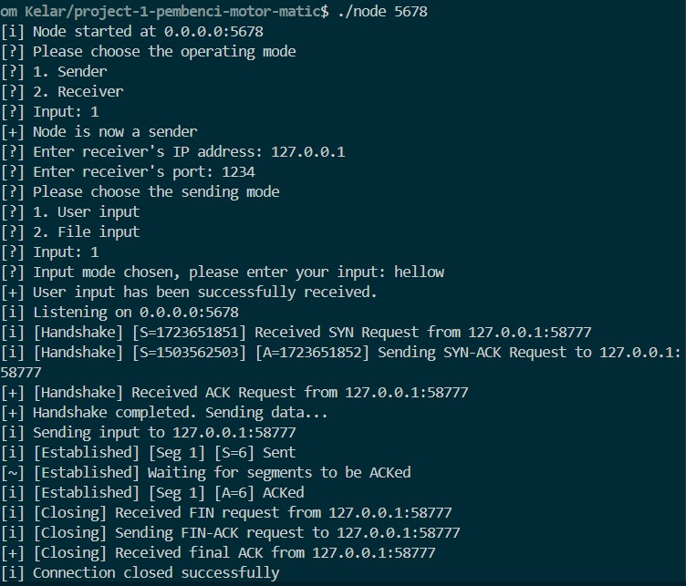
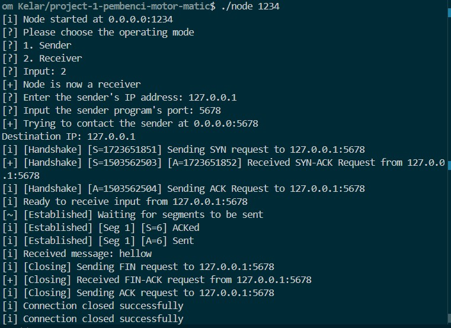

# Computer Networks Project 1 - IF2230 - 2024

> UDP-Based File Transfer System with TCP (Transmission Control Protocol) Reliability

## 🌠 Project Overview

<div style="display: flex; justify-content: space-between; align-items: end;">
    <div style="width: 48%; text-align: center;">
        
        <p>Sender Mode</p>
    </div>
    <div style="width: 48%; text-align: center;">
        
        <p>Receiver Mode</p>
    </div>
</div>

## 💁‍♂️ Group Member

<table>
    <tr>
        <td colspan="3", align = "center"><center>Nama Kelompok: pembenci-motor-matic</center></td>
    </tr>
    <tr>
        <td>No.</td>
        <td>Name</td>
        <td>Student ID</td>
    </tr>
    <tr>
        <td>1.</td>
        <td>Aland Mulia Pratama</td>
        <td>13522124</td>
    </tr>
    <tr>
        <td>2.</td>
        <td>Rizqika Mulia Pratama</td>
        <td>13522126</td>
    </tr>
    <tr>
        <td>3.</td>
        <td>Christian Justin Hendrawan</td>
        <td>13522135</td>
    </tr>
        <tr>
        <td>4.</td>
        <td>Ikhwan Al Hakim</td>
        <td>13522147</td>
    </tr>
</table>

## ️📝 General Descriptions

This project implements a file transfer system that mimics TCP behavior while utilizing the UDP protocol. The system provides a reliable and ordered communication channel between the sender and receiver, even over an unreliable network. It achieves this by combining UDP's simplicity with the reliability mechanisms typically found in TCP, such as the three-way handshake, sequence numbering, and Go-Back-N error control.

## 🔑 Key Features

### 1. **UDP Communication Protocol**

The program exclusively uses UDP (User Datagram Protocol) for communication. Unlike TCP, UDP is connectionless and does not guarantee delivery, so it is important to ensure reliability using additional mechanisms. All socket operations are carried out using datagram (UDP) sockets. Any use of TCP is prohibited, and it will result in a project score of zero.

### 2. **Receiver Mode - Discovery via Broadcast**

In receiver mode, the program sends a broadcast message to discover available senders in the network. This enables the receiver to find a sender without prior knowledge of its IP address, making the system more flexible and dynamic.

### 3. **Sender Mode - File Transfer**

The sender is capable of transmitting files of any type or extension. The file is sent as raw binary data to avoid corruption. The sender splits the file into smaller packets, each of which is transmitted independently over the network. This raw binary transmission ensures the file is sent exactly as it is, with no alteration or corruption.

### 4. **Handling Unreliable Network Channels**

The system operates under the assumption that the network is unreliable. Packets may be lost, duplicated, or corrupted, which is a common occurrence in UDP-based communication. The system is designed to handle such issues and recover lost data or retransmit corrupted packets.

### 5. **Three-Way Handshake**

Before initiating the file transfer, the sender and receiver perform a three-way handshake to establish a connection. This handshake helps to synchronize the two parties, ensuring both are ready for data transmission. If the handshake fails, appropriate error-handling mechanisms are in place to handle retries or report failure.

### 6. **Ordered Data Transmission**

The sender breaks the file into smaller segments, each assigned a unique sequence number. These segments are sent one by one, and the receiver uses the sequence numbers to reassemble the file in the correct order. This ensures that the file is received without any missing or out-of-order parts.

### 7. **Receiver Listening for Incoming Requests**

The receiver continuously listens for incoming connection requests from potential senders. When a request is received, the receiver responds by establishing a connection and preparing to accept the file transfer.

### 8. **Go-Back-N Error Control Protocol**

The system employs the Go-Back-N protocol to ensure reliable data transmission. Under this scheme, the sender can send several packets (up to a specified window size) before waiting for acknowledgments. If any packet is lost or corrupted, the sender will retransmit it along with all subsequent packets, ensuring no data is lost in the transmission process.

### 9. **Connection Termination**

After all file data has been successfully transmitted, the sender and receiver perform a connection termination procedure. This step ensures that both parties acknowledge the completion of the transfer and can cleanly close the connection.

### 10. **Multi-Machine Support**

The system is designed to run across multiple machines (either physical or virtual) within the same network. It supports communication between different devices, making it suitable for a variety of network environments.

### 11. **User Input for Configuration**

During program execution, users must provide the IP address for binding the server and the target port for communication. This allows flexibility in configuring the sender and receiver's network addresses, making the system adaptable to different network setups.

## 🗼 Program Structure

```bash
project-1-pembenci-motor-matic
├── README.md
├── gmon.out
├── header
│   ├── node.hpp
│   ├── segment.hpp
│   ├── segment_handler.hpp
│   └── socket.hpp
├── main.cpp
├── node.cpp
├── segment.cpp
├── segment_handler.cpp
├── socket.cpp
├── test
│   └── testpng.png
└── testpng.png
```

## 🔓 Requirements

1. C++ Programming Language
2. UNIX Based Operating System

## 🏃‍♂️ How to Run

1. Open the Project Folder in WSL

   Navigate to the project directory in your WSL (Windows Subsystem for Linux) environment.

2. Compile the Code

   Run the following command in the terminal to compile the source code into an executable:

   ```
   g++ main.cpp segment.cpp segment_handler.cpp socket.cpp node.cpp -o node
   ```
   Or alternatively you can also compile with C Make by executing this command to build:
   ```
   cmake .
   ```
   After executing build command, you can execute this command to make ./node executable:
   ```
   make
   ```

3. Run Two Program Simultaneously (Different PC or Mono PC)

   Receiver :

   ```
   ./node 6969
   ```

   Sender :

   ```
   ./node 1337
   ```

4. Sending data on Different PC

   - Make sure both PC are connected in the same devices.
   - Find out the IP Address of both PC, you can use IP Address Tracker Aplication or Check the the network configuration on each PC.
   - **For the receiver program**, set the correct sender IP Address and the program will wait for response/data from that IP Address.
   - **For the sender program**, set the correct receiver IP Address, chose the input type and also define the input.

5. Sending data with Mono PC

   - **For the receiver program**, set the receiver IP Address to 127.0.0.1 and the program will wait for response/data from the <i>localhost</i>.
   - **For the sender program**, set the correct sender IP Address to 127.0.0.1, chose the input type and also define the input.
